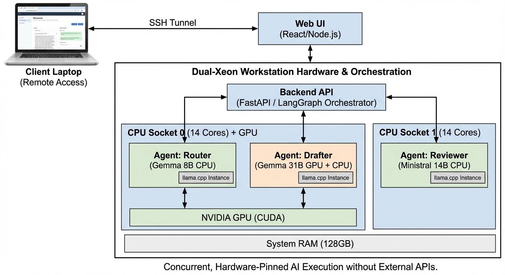

<p align="center">
  
</p>

<h1 align="center">NumaScribe</h1>

<p align="center">
  <strong>A Privacy-First, Multi-Agent Scientific Writing Assistant</strong><br/>
  <em>Powered by locally-hosted LLMs on NUMA-optimized hardware — no cloud APIs, no data leaks.</em>
</p>

<p align="center">
  <a href="#quickstart"></a>
  <a href="#architecture"></a>
  <a href="#hpc-deployment"></a>
</p>

---

## Overview

NumaScribe is a fully self-hosted, multi-agent AI system for scientific manuscript authoring. It orchestrates a team of specialized LLM agents — a **Drafter**, a **Reviewer**, and a **Router** — that collaborate through a LangGraph state machine to produce, critique, and refine publication-quality scientific text.

### Key Principles

- **🔒 Absolute Privacy** — All inference runs locally via `llama.cpp`. Your unpublished research never touches third-party servers.
- **🧠 Multi-Agent Collaboration** — A 31B-parameter Drafter writes, a 14B Reasoning Reviewer critiques, and an 8B Router orchestrates the workflow.
- **⚡ Hardware-Aware Execution** — NUMA-pinned CPU socket binding and GPU offloading tuned for Dual-Xeon workstations and HPC GPU nodes.
- **📐 Scientific Rendering** — LaTeX equations, structured Markdown, and KaTeX rendering in the browser.

---

## Architecture

<p align="center">
  
</p>

<p align="center"><em>Concurrent, hardware-pinned AI execution without external APIs.</em></p>

The system runs three independent `llama.cpp` server instances, each hosting a specialized GGUF model. A FastAPI/LangGraph backend coordinates multi-turn Draft → Review → Revise cycles, while a React frontend provides real-time streaming and scientific rendering.

| Agent | Model | Role | Hardware Target |
|-------|-------|------|-----------------|
| **Drafter** | Gemma 4 31B (Q4_K_M) | Primary scientific writer | GPU + CPU Socket 0 |
| **Reviewer** | Ministral 3 14B Reasoning (Q8_0) | Critical analysis & feedback | CPU Socket 1 |
| **Router** | Gemma 4 E4B (Q4_K_M) | Task classification & RAG | CPU Socket 0 |

---

<a id="quickstart"></a>
## 🚀 Quick Start

### Prerequisites

- **OS:** Linux (Ubuntu 22.04+ recommended)
- **Hardware:** NVIDIA GPU with ≥8 GB VRAM; ≥64 GB system RAM
- **Software:** CUDA Toolkit 11.5+, Node.js v18+, Python 3.10+

### Step 1: Install and Compile `llama.cpp`

```bash
cd ~
git clone https://github.com/ggml-org/llama.cpp.git
cd llama.cpp

# Install a stable compiler for NVCC compatibility
sudo apt-get update && sudo apt-get install gcc-10 g++-10

# Build with CUDA support
cmake -B build -DGGML_CUDA=ON \
    -DCMAKE_C_COMPILER=gcc-10 \
    -DCMAKE_CXX_COMPILER=g++-10 \
    -DCMAKE_CUDA_HOST_COMPILER=g++-10
cmake --build build --config Release -j $(nproc)

# Make the server binary globally accessible
sudo cp build/bin/llama-server /usr/local/bin/
```

### Step 2: Download GGUF Models

```bash
mkdir -p models && cd models

# Drafter — Gemma 4 31B (GPU-accelerated primary writer)
wget https://huggingface.co/ggml-org/gemma-4-31B-it-GGUF/resolve/main/gemma-4-31B-it-Q4_K_M.gguf

# Reviewer — Ministral 3 14B Reasoning (CPU-bound critique agent)
wget https://huggingface.co/ggml-org/Ministral-3-14B-Reasoning-2512-GGUF/resolve/main/Ministral-3-14B-Reasoning-2512-Q8_0.gguf

# Router — Gemma 4 E4B (Fast task classification)
wget https://huggingface.co/ggml-org/gemma-4-E4B-it-GGUF/resolve/main/gemma-4-e4b-it-Q4_K_M.gguf
```

### Step 3: Configure Environment

```bash
cp .env.example .env
# Edit .env and set a secure JWT_SECRET (this is your login password)
```

### Step 4: Launch the System

Start each layer in a **separate terminal**:

```bash
# Terminal 1 — Agent Engines (NUMA-pinned llama.cpp instances)
./scripts/start_agents.sh

# Terminal 2 — Backend API (FastAPI + LangGraph orchestrator)
./scripts/start_backend.sh

# Terminal 3 — Web UI (React + Vite)
cd frontend && npm install && npm run dev
```

Open your browser at **http://localhost:5173** and log in with the credentials from your `.env` file.

---

## Remote Access via SSH Tunnel

If the workstation is headless or you want to access it from a laptop:

```bash
# On your laptop:
./scripts/tunnel.sh YOUR_USERNAME WORKSTATION_IP
# Example: ./scripts/tunnel.sh arka 192.168.1.50
```

Then visit **http://localhost:7001** in your laptop browser.

---

<a id="hpc-deployment"></a>
## 🖥️ HPC Deployment (Singularity / Apptainer)

NumaScribe is fully containerized for HPC clusters with SLURM job schedulers.

### Supported GPU Configurations

| GPU | VRAM | All Agents on GPU? | SBATCH Script |
|-----|------|---------------------|---------------|
| NVIDIA L40S | 48 GB | ✅ Yes (all 3 agents) | `run_agents_l40s.sbatch` |
| NVIDIA H100 | 80 GB | ✅ Yes (all 3 agents) | `run_agents_l40s.sbatch` |
| NVIDIA A100 | 40/80 GB | ✅ Yes | `run_agents.sbatch` |

### Quick HPC Workflow

```bash
# 1. Build the container locally (requires sudo)
cd Singularity && ./hpc_build.sh

# 2. Transfer to the cluster
rsync -avzP . user@login.hpc.institution.be:$SCRATCH/NumaScribe/

# 3. Download models directly on the cluster
ssh user@login.hpc.institution.be
mkdir -p $SCRATCH/models && cd $SCRATCH/models
wget <model_urls>

# 4. Submit the SLURM job
sbatch Singularity/run_agents_l40s.sbatch

# 5. Open SSH tunnel from your laptop
ssh -N -L 5173:NODE:5173 -L 8000:NODE:8000 user@login.hpc.institution.be

# 6. Open http://localhost:5173
```

> 📖 See [`Singularity/HPC_INSTRUCTIONS.md`](Singularity/HPC_INSTRUCTIONS.md) for the complete VSC-specific deployment guide.

---

## Engineering Decisions & Resolved Issues

<details>
<summary><strong>🔧 Click to expand the full technical changelog</strong></summary>

### 1. NUMA Binding & VRAM Isolation
- **Problem:** Multiple `llama.cpp` instances collided on GPU VRAM, causing OOM crashes.
- **Fix:** Injected `CUDA_VISIBLE_DEVICES=""` for CPU-only agents. Pinned the Drafter to `-ngl 5` layers for 8GB Quadro cards, or `-ngl 99` for 48GB L40S/H100 nodes.

### 2. Gemma-4 "Thinking" Prefill Bug (`400 Bad Request`)
- **Problem:** LangGraph's state array injected prior assistant messages that crashed Gemma's `<think>` token boundaries.
- **Fix:** Rewrote `backend/agents.py` to flatten Reviewer feedback into a single contiguous User message, preventing format validation errors.

### 3. CUDA Stub Linking in Singularity
- **Problem:** `libcuda.so.1: undefined reference to cuMemCreate` during container builds — the CUDA driver doesn't exist at build time.
- **Fix:** Created temporary `libcuda.so.1` symlinks to CUDA stubs and injected explicit `CMAKE_EXE_LINKER_FLAGS` during the cmake phase.

### 4. `passlib` / `bcrypt` 4.x Incompatibility
- **Problem:** Container ships `bcrypt` 4.x which removed the `__about__` attribute, breaking `passlib.hash.bcrypt`.
- **Fix:** Replaced `passlib` with direct `bcrypt.hashpw()` / `bcrypt.checkpw()` calls.

### 5. Real-Time Log Streaming
- **Feature:** Built a live terminal emulator in React connected to a `/logs/stream` FastAPI endpoint, providing real-time GPU execution feedback during long generation runs.

### 6. Scientific Markdown + LaTeX Rendering
- **Feature:** Integrated `react-markdown`, `remark-math`, and `rehype-katex` for native browser rendering of equations, tables, and formatted scientific text.

</details>

---

## Project Structure

```
NumaScribe/
├── backend/              # FastAPI + LangGraph agent orchestrator
│   ├── main.py           # API endpoints and streaming
│   ├── agents.py         # Drafter/Reviewer/Router node definitions
│   ├── llm_client.py     # llama.cpp HTTP client
│   └── auth.py           # JWT authentication
├── frontend/             # React + Vite scientific UI
│   └── src/App.tsx       # Main application with KaTeX rendering
├── scripts/              # Launch and tunnel scripts
├── Singularity/          # HPC container definitions
│   ├── manuscript_hpc.def
│   ├── run_agents_l40s.sbatch
│   └── HPC_INSTRUCTIONS.md
├── models/               # GGUF model weights (git-ignored)
└── images/               # Logo and architecture diagrams
```

---

## License

This project is open-source. See [LICENSE](LICENSE) for details.

---

<p align="center">
  <em>Built for researchers who refuse to upload their unpublished data to the cloud.</em>
</p>
